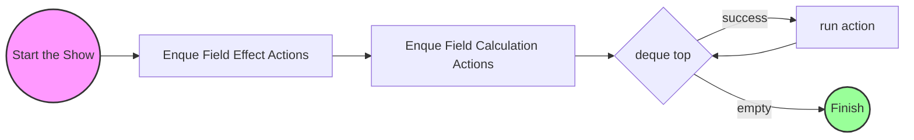
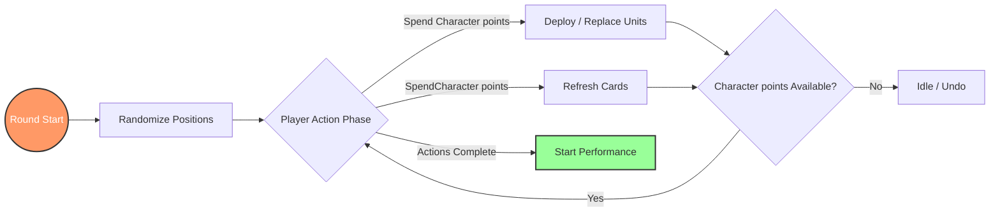
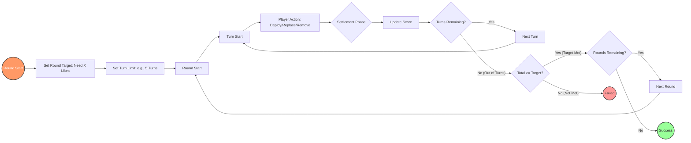
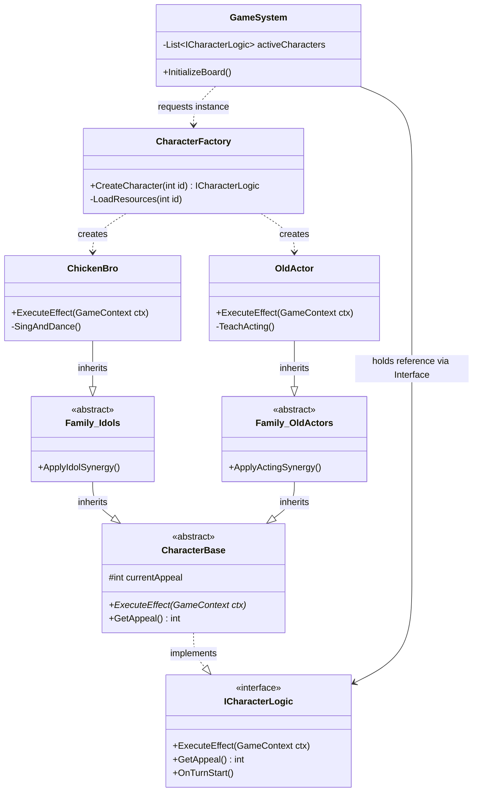

```mermaid
graph LR
    Start((Start the Show)) --> EnqueEffect[Enque Field Effect Actions] --> EnqueCalculation[Enque Field Calculation Actions]
    EnqueCalculation --> DequeTop(start run queue)
    DequeTop{deque top} -- success --> RunFunction[run action]
    
    RunFunction --> DequeTop

	%% RunFunction --Field calculation--> FieldCal[field calculation]
    %% FieldEffect --card exist--> StartEffect[card effect] --> DequeTop
    %% FieldEffect -- no card --> DequeTop
    
    %% RunFunction --field effect--> FieldEffect[field effect] 
    %% FieldCal -- card exist --> StartCalculation[card score calculation] --> DequeTop
    %% FieldCal -- no card --> DequeTop
    
    %% RunFunction -- other action --> RunAction[Run action] --> DequeTop
    
    DequeTop -- empty --> Finish((Finish))
    
    style Start fill:#f9f,stroke:#333,stroke-width:2px
    style Finish fill:#9f9,stroke:#333,stroke-width:2px
```

```mermaid
graph LR
    %% Define Styles
    classDef start fill:#f96,stroke:#333,stroke-width:2px,color:white;
    classDef process fill:#fff,stroke:#333,stroke-width:1px;
    classDef decision fill:#ff9,stroke:#333,stroke-width:1px;
    classDef endnode fill:#9f9,stroke:#333,stroke-width:2px;

    %% Flow Start
    Start((Round Start)):::start --> Randomize[Randomize Positions]
    Randomize --> PlayerPhase{Player Action Phase}

    %% Player Actions
    PlayerPhase -->|Spend Character points| ManageCards[Deploy / Replace Units]
    PlayerPhase -->|SpendCharacter points| Refresh[Refresh Cards]

    %% Resource Check Loop
    ManageCards --> CheckRes{Character points Available?}
    Refresh --> CheckRes

    CheckRes -- Yes --> PlayerPhase
    CheckRes -- No --> Wait[Idle / Undo]

    %% End Phase
    PlayerPhase -- Actions Complete --> Performance[Start Performance]:::endnode
```

```mermaid
graph LR
    %% Define Styles
    classDef start fill:#f96,stroke:#333,stroke-width:2px,color:white;
    classDef logic fill:#fff,stroke:#333,stroke-width:1px;
    classDef score fill:#ff9,stroke:#333,stroke-width:1px;
    classDef success fill:#9f9,stroke:#333,stroke-width:2px;
    classDef fail fill:#f99,stroke:#333,stroke-width:2px;

    %% Flow Start
    Start((Round Start)):::start --> InitRound[Set Round Target: Need X Likes]
    InitRound --> SetTurns[Set Turn Limit: e.g., 5 Turns]
    SetTurns --> RoundStart[Round Start]
    RoundStart --> TurnStart[Turn Start]

    %% Core Loop
    TurnStart --> PlayerAct[Player Action: Deploy/Replace/Remove]
    PlayerAct --> Settlement{Settlement Phase}
    Settlement --> UpdateTotal[Update Score]

    %% Validation Logic
    UpdateTotal --> CheckTurn{Turns Remaining?}
    CheckTurn -- Yes --> NextTurn[Next Turn]
    NextTurn --> TurnStart
    CheckTurn -- No (Out of Turns) --> CheckTarget{Total >= Target?}
    
    %% Success Path
    CheckTarget -- Yes (Target Met) --> CheckRound{Rounds Remaining?}
    CheckRound -- Yes --> NextRound[Next Round]
    NextRound --> RoundStart
    CheckRound -- No --> RoundPass((Success)):::success

    %% Fail Path
    CheckTarget -- No (Not Met) --> GameOver((Failed)):::fail


```

```mermaid
classDiagram
    %% 1. 核心接口 (The Contract)
    class ICharacterLogic {
        <<interface>>
        +ExecuteEffect(GameContext ctx)
        +GetAppeal() int
        +OnTurnStart()
    }

    %% 2. 基础抽象类 (Base Class)
    class CharacterBase {
        <<abstract>>
        #int currentAppeal
        +ExecuteEffect(GameContext ctx)*
        +GetAppeal() int
    }

    %% 3. 家族层 (Family Layer - Middle Tier)
    class Family_Idols {
        <<abstract>>
        +ApplyIdolSynergy()
    }
    class Family_OldActors {
        <<abstract>>
        +ApplyActingSynergy()
    }

    %% 4. 具体角色层 (Concrete Implementations)
    class ChickenBro {
        +ExecuteEffect(GameContext ctx)
        -SingAndDance()
    }
    class OldActor {
        +ExecuteEffect(GameContext ctx)
        -TeachActing()
    }

    %% 5. 工厂类 (The Creator)
    class CharacterFactory {
        +CreateCharacter(int id) ICharacterLogic
        -LoadResources(int id)
    }

    %% 6. 外部系统 (The Client)
    class GameSystem {
        -List~ICharacterLogic~ activeCharacters
        +InitializeBoard()
    }

    %% --- 关系定义 ---

    %% 实现与继承关系
    CharacterBase ..|> ICharacterLogic : implements
    Family_Idols --|> CharacterBase : inherits
    Family_OldActors --|> CharacterBase : inherits
    ChickenBro --|> Family_Idols : inherits
    OldActor --|> Family_OldActors : inherits

    %% 工厂依赖关系 (Factory creates Concretes, returns Interface)
    CharacterFactory ..> ChickenBro : creates
    CharacterFactory ..> OldActor : creates

    %% 系统依赖关系 (System only cares about Interface & Factory)
    GameSystem ..> CharacterFactory : requests instance
    GameSystem --> ICharacterLogic : holds reference via Interface
```

